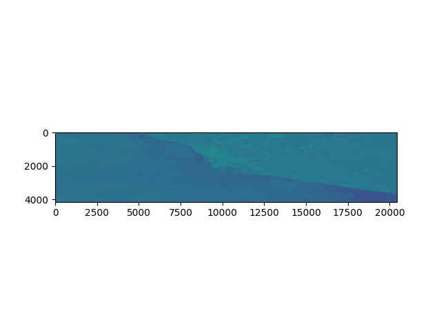

[](https://github.com/JosefDoun/libSAR/actions/workflows/test.yml)

# libSAR
A Python SAR image handling library, planned to be developed around easy Interferometry through a pythonic interface.

## __Early development.__


Implemented:
- Base data structures for Sentinel 1 data components.
- Sentinel 1 Single Look Complex data structure.
- Debursting class for S1SLC (To be potentially abstracted or extended to share with other sensors).


Example:

```
>>> from libSAR.sentinel1 import SLC;
>>> img = SLC("S1A_IW_SLC__1SDV_20230111T060136_20230111T060203_046732_059A26_F5B0.SAFE");

```

Through the SLC object you can index into the individual Swath objects.
```
>>> img[:]
[<SubSwath 1 object>, <SubSwath 2 object>, <SubSwath 3 object>]
```

Each Swath object consists of the different polarisation bands.
```
>>> img[0][:]
[<Band VV object>, <Band VH object>]
```

And finally, each band consists of the individual bursts associated with it.
```
>>> img[0][0][5]
<Burst 5 object>
```

At the burst level, one can retrieve the complex array, the amplitude, or the phase, by accessing the array, amplitude or phase attributes.
```
>>> img[0][0][0].array
array([[  38.  -3.j,  -46. -19.j,  -46. -65.j, ...,  -11. +32.j,
         -48. +28.j,  -10. +85.j],
       [ -22.  +5.j,   68. +24.j,   -1.+122.j, ...,   13. +64.j,
          21.  -8.j,   59. +30.j],
       [ -19. -15.j,  -51. +20.j,   61. +17.j, ...,    1. +42.j,
        -144. -15.j,    6. +20.j],
       ...,
       [   0. +57.j,   -5. +36.j,   73.+137.j, ...,   91.  -9.j,
          14. -15.j,  -92.  -6.j],
       [  61. -46.j,   32. -12.j, -101. -70.j, ...,  -10. +51.j,
         -33. -61.j,  -35.-114.j],
       [ -51.  +3.j,    6. +33.j,   79. +38.j, ...,  -11.  -5.j,
          56. -30.j,   38.  -8.j]], dtype=complex64)

>>> img[0][0][1].amplitude
array([[19.857433, 16.589478, 17.61316 , ..., 21.410704, 18.676582,
        17.509897],
       [20.49218 , 18.385714, 18.71272 , ..., 17.336042, 16.55937 ,
        15.21779 ],
       [20.390436, 13.222193, 15.836103, ..., 19.230612, 19.45134 ,
        16.931303],
       ...,
       [21.147705, 18.52652 , 21.175898, ..., 23.081623, 19.90104 ,
        18.752958],
       [21.336336, 19.67491 , 22.554543, ..., 23.773571, 20.230309,
        20.224583],
       [19.47748 , 16.902884, 19.607317, ..., 20.383284, 17.634937,
        17.38084 ]], dtype=float32)

>>> img[0][0][2].phase
array([[ 2.1962814 , -2.8250234 , -3.1080322 , ...,  1.9513026 ,
         0.5144513 , -1.6598458 ],
       [-1.0636978 ,  0.43722206,  0.1271302 , ..., -1.5707964 ,
        -2.4496713 , -2.9736967 ],
       [ 2.3592527 ,  2.3102498 , -0.0499584 , ...,  2.9516044 ,
         1.69142   ,  2.2455373 ],
       ...,
       [ 2.6387496 , -1.6383625 , -2.212367  , ..., -2.861293  ,
         1.9513026 ,  2.0344439 ],
       [ 0.95054686,  2.154975  ,  2.2962663 , ..., -1.1071488 ,
        -2.0583916 , -1.8473102 ],
       [ 0.93804747, -0.2606024 ,  0.16137512, ...,  0.63274884,
        -0.42285392,  0.35072795]], dtype=float32)

```

By indexing multiple bursts, one can form a BurstGroup object, which combines the individual bursts and returns their combined arrays when accessing the same array, amplitude or phase attributes.

```
>>> img[0][0][3:6]
<BurstGroup [3, 4, 5] object>

>>> plt.imshow(img[0][0][3:6].amplitude); plt.show();
<matplotlib.image.AxesImage object at 0x7f7b3ef77e20>
```

<div align='center' width='33%'>
<figure>
 
 <figcaption>
 Figure 1: Plotted BurstGroup amplitude example.
 </figcaption>
</figure>
</div>


## # TODO
- Solve geolocation.
- Swath merging.
- ...

